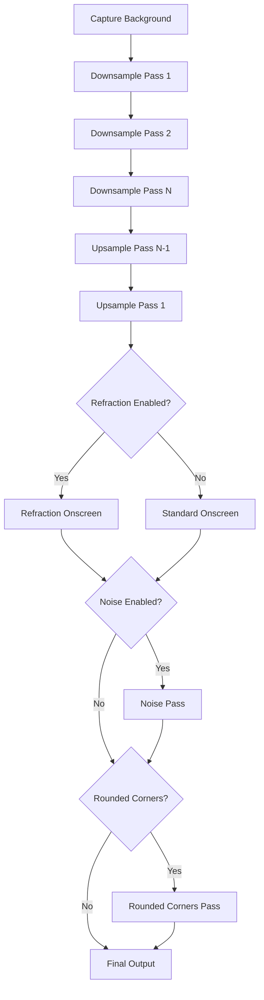

## Shader Files Overview

Better Blur DX uses separate shader programs for each stage of the blur pipeline. All shaders are located in `src/shaders/` and compiled into the plugin as Qt resources.

### Shader Variants

Each shader comes in two variants:

- **Legacy OpenGL** (`.vert`, `.frag`): GLSL 1.20 for older systems
- **Core OpenGL** (`_core.vert`, `_core.frag`): GLSL 1.40 for modern systems

KWin's `ShaderManager` automatically selects the appropriate variant based on the OpenGL context.

## Vertex Shaders

### Standard Vertex Shader

**Files**: `vertex.vert`, `vertex_core.vert`

Used by most passes (downsample, upsample, noise, onscreen):

```glsl
uniform mat4 modelViewProjectionMatrix;

attribute vec2 position;
attribute vec2 texcoord;

varying vec2 uv;

void main(void)
{
    gl_Position = modelViewProjectionMatrix * vec4(position, 0.0, 1.0);
    uv = texcoord;
}
```

**Purpose**: Transforms vertex positions and passes texture coordinates to fragment shader.

<ParamField path="modelViewProjectionMatrix" type="mat4">
  Combined transformation matrix for viewport projection. Set in blur.cpp via `uniformLocation()` calls.
</ParamField>

### Rounded Vertex Shaders

**Files**: `onscreen_rounded.vert`, `rounded_corners.vert` (+ `_core` variants)

Used for rounded corner rendering:

```glsl
uniform mat4 modelViewProjectionMatrix;

attribute vec2 position;
attribute vec2 texcoord;

varying vec2 uv;
varying vec2 vertex;  // Additional output for SDF calculations

void main(void)
{
    gl_Position = modelViewProjectionMatrix * vec4(position, 0.0, 1.0);
    vertex = position;
    uv = texcoord;
}
```

**Difference**: Passes vertex position to fragment shader for signed distance field (SDF) calculations.

## Fragment Shaders

### Onscreen Pass Shader

**Files**: `onscreen.frag`, `onscreen_core.frag`  
**Loaded in**: `blur.cpp:120-131`

Final rendering of blurred texture with color correction:

```glsl
uniform sampler2D texUnit;
uniform mat4 colorMatrix;
uniform float offset;
uniform vec2 halfpixel;

varying vec2 uv;

void main(void)
{
    // 8-sample tent filter (same as upsample)
    vec4 sum = texture2D(texUnit, uv + vec2(-halfpixel.x * 2.0, 0.0) * offset);
    sum += texture2D(texUnit, uv + vec2(-halfpixel.x, halfpixel.y) * offset) * 2.0;
    // ... 6 more samples ...
    
    gl_FragColor = (sum / 12.0) * colorMatrix;
}
```

<Expandable title="Shader Uniforms">
  <ParamField path="texUnit" type="sampler2D">
    The blurred texture from the final upsample pass
  </ParamField>
  
  <ParamField path="colorMatrix" type="mat4">
    Color transformation matrix (brightness, contrast, saturation)
  </ParamField>
  
  <ParamField path="offset" type="float">
    Sample offset multiplier (m_offset from blur strength calculation)
  </ParamField>
  
  <ParamField path="halfpixel" type="vec2">
    Half-pixel offset for precise sampling
  </ParamField>
</Expandable>

### Downsample Shader

**Files**: `downsample.frag`, `downsample_core.frag`  
**Loaded in**: `blur.cpp:149-159`

Implements the Kawase downsample algorithm:

```glsl
void main(void)
{
    vec4 sum = texture2D(texUnit, uv) * 4.0;  // Center pixel, weight 4
    sum += texture2D(texUnit, uv - halfpixel.xy * offset);               // Top-left
    sum += texture2D(texUnit, uv + halfpixel.xy * offset);               // Bottom-right  
    sum += texture2D(texUnit, uv + vec2(halfpixel.x, -halfpixel.y) * offset);   // Top-right
    sum += texture2D(texUnit, uv - vec2(halfpixel.x, -halfpixel.y) * offset);   // Bottom-left

    gl_FragColor = sum / 8.0;
}
```

**Sampling Pattern**:
```
    X
  X C X
    X
```
Where C = center (weight 4), X = diagonal samples (weight 1 each)

### Upsample Shader

**Files**: `upsample.frag`, `upsample_core.frag`  
**Loaded in**: `blur.cpp:161-171`

Implements the Kawase upsample with tent filter:

```glsl
void main(void)
{
    vec4 sum = texture2D(texUnit, uv + vec2(-halfpixel.x * 2.0, 0.0) * offset);
    sum += texture2D(texUnit, uv + vec2(-halfpixel.x, halfpixel.y) * offset) * 2.0;
    sum += texture2D(texUnit, uv + vec2(0.0, halfpixel.y * 2.0) * offset);
    sum += texture2D(texUnit, uv + vec2(halfpixel.x, halfpixel.y) * offset) * 2.0;
    sum += texture2D(texUnit, uv + vec2(halfpixel.x * 2.0, 0.0) * offset);
    sum += texture2D(texUnit, uv + vec2(halfpixel.x, -halfpixel.y) * offset) * 2.0;
    sum += texture2D(texUnit, uv + vec2(0.0, -halfpixel.y * 2.0) * offset);
    sum += texture2D(texUnit, uv + vec2(-halfpixel.x, -halfpixel.y) * offset) * 2.0;

    gl_FragColor = sum / 12.0;
}
```

**Sampling Pattern**:
```
  1
2   2
  1
2   2
```
Total weight: 12

### Noise Shader

**Files**: `noise.frag`, `noise_core.frag`  
**Loaded in**: `blur.cpp:173-182`

Adds dithering to prevent banding:

```glsl
uniform sampler2D texUnit;
uniform vec2 noiseTextureSize;

varying vec2 uv;

void main(void)
{
    vec2 uvNoise = vec2(gl_FragCoord.xy / noiseTextureSize);
    gl_FragColor = vec4(texture2D(texUnit, uvNoise).rrr, 0);
}
```

<Note>
  Uses `gl_FragCoord` (screen coordinates) instead of `uv` to ensure noise pattern doesn't scale with window size.
</Note>

**Rendering**: Applied with additive blending (`GL_ONE, GL_ONE`) over the blurred result (blur.cpp:1142-1147).

## Rounded Corners Shaders

### Rounded Onscreen Shader

**Files**: `onscreen_rounded.frag`, `onscreen_rounded_core.frag`  
**Loaded in**: `blur.cpp:133-147`

Combines blur rendering with rounded corner masking:

```glsl
#extension GL_OES_standard_derivatives : enable
#include "sdf.glsl"

uniform sampler2D texUnit;
uniform mat4 colorMatrix;
uniform vec4 box;           // Window bounds (center_x, center_y, half_width, half_height)
uniform vec4 cornerRadius;  // Per-corner radii (top-left, top-right, bottom-left, bottom-right)
uniform float opacity;

varying vec2 uv;
varying vec2 vertex;

void main(void)
{
    // Apply blur (8-sample tent filter)
    vec4 sum = texture2D(texUnit, uv + vec2(-halfpixel.x * 2.0, 0.0) * offset);
    // ... 7 more samples ...
    vec4 fragColor = (sum / 12.0) * colorMatrix * opacity;

    // Apply rounded corner mask using SDF
    float f = sdfRoundedBox(vertex, box.xy, box.zw, cornerRadius);
    float df = fwidth(f);  // Derivative for anti-aliasing
    fragColor *= 1.0 - clamp(0.5 + f / df, 0.0, 1.0);

    gl_FragColor = fragColor;
}
```

**Used when**: Window has native border radius (currently disabled, see `BETTERBLUR_NOT_NEEDED` in blur.cpp:1051)

### Rounded Corners Pass Shader

**Files**: `rounded_corners.frag`, `rounded_corners_core.frag`  
**Referenced in**: `rounded_corners_pass.hpp`

Applies rounded corners as a post-process:

```glsl
void main(void)
{
    vec4 fragColor = texture2D(texUnit, uv);

    float f = sdfRoundedBox(vertex, box.xy, box.zw, cornerRadius);
    float df = fwidth(f);
    float inv_alpha = clamp(0.5 + f / df, 0.0, 1.0);
    fragColor *= inv_alpha;

    gl_FragColor = fragColor;
}
```

**Used by**: `RoundedCornersPass::apply()` for user-configured rounded corners (blur.cpp:1168-1170)

<Expandable title="Signed Distance Field (SDF)">
  The `sdfRoundedBox()` function (defined in `sdf.glsl`) returns the signed distance from a point to a rounded rectangle's edge:
  
  - **Negative**: Inside the shape
  - **Zero**: On the edge
  - **Positive**: Outside the shape
  
  Combined with `fwidth()` (derivative), this creates smooth anti-aliased edges without jagged pixels.
</Expandable>

## Refraction Shaders

**Files**: `refraction.frag`, `refraction_rounded.frag` (+ `_core` variants)  
**Referenced in**: `refraction_pass.hpp`

Advanced experimental shaders for glass-like refraction effects.

### Basic Refraction

```glsl
uniform float refractionStrength;
uniform float refractionEdgeSizePixels;
uniform float refractionCornerRadiusPixels;
uniform int refractionMode;  // 0: Basic, 1: Concave

void main(void) {
    // Calculate distance to rounded rectangle edge
    vec2 position = uv * refractionRectSize - halfRefractionRectSize;
    float dist = roundedRectangleDist(position, halfRefractionRectSize, cornerR);
    
    // Compute edge proximity for refraction strength
    float edgeProximity = clamp(1.0 + dist / refractionEdgeSizePixels, 0.0, 1.0);
    
    // Apply refraction offset based on surface normal
    vec2 normal = computeNormal(position);
    vec2 refractOffset = normal * refractionStrength * edgeProximity;
    
    // Sample with offset
    gl_FragColor = texture2D(texUnit, uv - refractOffset) * colorMatrix;
}
```

**Features**:
- Edge-based refraction (stronger near borders)
- RGB chromatic aberration/fringing
- Two modes: convex (bulge) and concave (lens)
- Texture repeat mode options (clamp/mirror)

<Note>
  Refraction shaders are optional and controlled by `RefractionPass` mixin. See `refraction_pass.hpp` for implementation details.
</Note>

## Shader Loading

Shaders are loaded in the `BlurEffect` constructor (blur.cpp:115-189):

```cpp
m_onscreenPass.shader = ShaderManager::instance()->generateShaderFromFile(
    ShaderTrait::MapTexture,
    QStringLiteral(":/effects/better_blur_dx/shaders/vertex.vert"),
    QStringLiteral(":/effects/better_blur_dx/shaders/onscreen.frag")
);

if (!m_onscreenPass.shader) {
    qCWarning(KWIN_BLUR) << BBDX::LOG_PREFIX << "Failed to load onscreen pass shader";
    return;
}

// Cache uniform locations for performance
m_onscreenPass.mvpMatrixLocation = 
    m_onscreenPass.shader->uniformLocation("modelViewProjectionMatrix");
m_onscreenPass.colorMatrixLocation = 
    m_onscreenPass.shader->uniformLocation("colorMatrix");
m_onscreenPass.offsetLocation = 
    m_onscreenPass.shader->uniformLocation("offset");
m_onscreenPass.halfpixelLocation = 
    m_onscreenPass.shader->uniformLocation("halfpixel");
```

### Shader Structs

Each render pass stores its shader and uniform locations in a struct (blur.h:130-176):

```cpp
struct {
    std::unique_ptr<GLShader> shader;
    int mvpMatrixLocation;
    int colorMatrixLocation;
    int offsetLocation;
    int halfpixelLocation;
} m_onscreenPass;
```

This avoids expensive `uniformLocation()` lookups during rendering.

## Core vs Legacy OpenGL

### Version Detection

KWin's `ShaderManager` automatically chooses:
- **Legacy**: OpenGL 2.1 / GLSL 1.20 (default on older systems)
- **Core**: OpenGL 3.1+ / GLSL 1.40 (modern systems)

### Key Differences

<Tabs>
  <Tab title="Attribute Syntax">
    **Legacy**:
    ```glsl
    attribute vec2 position;
    varying vec2 uv;
    ```
    
    **Core**:
    ```glsl
    in vec2 position;
    out vec2 uv;
    ```
  </Tab>
  
  <Tab title="Texture Sampling">
    **Legacy**:
    ```glsl
    texture2D(texUnit, uv)
    gl_FragColor = ...
    ```
    
    **Core**:
    ```glsl
    texture(texUnit, uv)
    fragColor = ...  // with 'out vec4 fragColor'
    ```
  </Tab>
  
  <Tab title="Version Directive">
    **Legacy**:
    ```glsl
    // No version directive (defaults to 1.20)
    ```
    
    **Core**:
    ```glsl
    #version 140
    ```
  </Tab>
</Tabs>

### Compatibility

Better Blur DX maintains identical shader logic in both variants, only syntax differs. This ensures the effect works on:

- Modern Linux desktops (core profile)
- Older hardware (legacy profile)
- X11 and Wayland sessions
- Virtual machines with limited GL support

## Shader Pipeline Flow



## Performance Optimizations

### Uniform Location Caching

Uniform locations are cached at shader load time (blur.cpp:127-130, etc.):

```cpp
m_onscreenPass.mvpMatrixLocation = 
    m_onscreenPass.shader->uniformLocation("modelViewProjectionMatrix");
```

This avoids string lookups every frame.

### Shader State Management

Shaders are pushed/popped from `ShaderManager` stack (blur.cpp:995, 1018, etc.):

```cpp
ShaderManager::instance()->pushShader(m_downsamplePass.shader.get());
// ... render ...
ShaderManager::instance()->popShader();
```

This allows KWin to restore previous shader state for other effects.

### Texture Filtering

All textures use `GL_LINEAR` filtering (blur.cpp:854):

```cpp
texture->setFilter(GL_LINEAR);
texture->setWrapMode(GL_CLAMP_TO_EDGE);
```

- `GL_LINEAR`: Hardware-accelerated bilinear interpolation
- `GL_CLAMP_TO_EDGE`: Prevents edge artifacts when sampling near borders

## Debugging Shaders

Shader compilation errors are logged via KWin's logging system:

```cpp
if (!m_downsamplePass.shader) {
    qCWarning(KWIN_BLUR) << BBDX::LOG_PREFIX << "Failed to load downsampling pass shader";
    return;
}
```

View shader errors with:
```bash
QT_LOGGING_RULES="kwin_effect_better_blur_dx=true" kwin_wayland --replace
```

<Warning>
  If any shader fails to load, the entire effect becomes inactive (`m_valid = false`). Check `~/.xsession-errors` or `journalctl` for shader compilation errors.
</Warning>