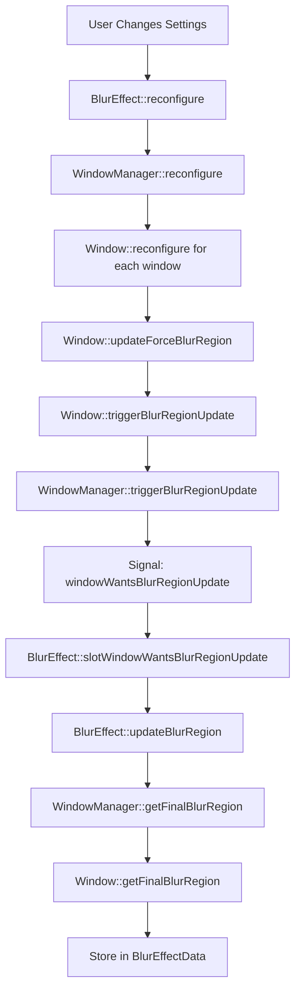

## Overview

Better Blur DX uses a two-class system for tracking and managing window state:

- **`WindowManager`** (`window_manager.hpp`): Singleton that manages all windows and configuration
- **`Window`** (`window.hpp`): Per-window state tracker for blur regions, transforms, and geometry

This architecture separates global configuration from per-window state management.

## WindowManager Class

Defined in `window_manager.hpp:32-145`, the `WindowManager` class is responsible for:

- Tracking all managed windows
- Window class matching (whitelist/blacklist with regex support)
- Global blur configuration (decorations, docks, menus)
- Maximized state tracking across multiple windows

### Key Members

```cpp
class WindowManager : public QObject {
private:
    // Managed windows
    std::unordered_map<const KWin::EffectWindow *, 
                       std::unique_ptr<BBDX::Window>> m_windows{};

    // Docks tracked separately for maximized calculations
    std::unordered_set<const KWin::EffectWindow *> m_docks{};

    // Window class matching
    QList<QString> m_windowClassesFixed{};           // Exact matches
    QList<QRegularExpression> m_windowClassesRegex{};  // Regex patterns
    WindowClassMatchMode m_windowClassMatchMode;     // Whitelist or Blacklist

    // Global settings
    bool m_blurDecorations{false};
    bool m_blurDocks{false};
    bool m_blurMenus{false};
    qreal m_userBorderRadius{0.0};
};
```

### Window Class Matching

**Defined in**: `window_manager.hpp:36-39, 49-51`

#### Match Modes

```cpp
enum class WindowClassMatchMode {
    Whitelist,  // Only blur windows matching the list
    Blacklist,  // Blur all windows except those matching
};
```

#### Matching Methods

<ParamField path="matchesWindowClassFixed" type="bool">
  Checks if window class exactly matches any string in `m_windowClassesFixed`
</ParamField>

<ParamField path="matchesWindowClassRegex" type="bool">
  Tests window class against all `QRegularExpression` patterns in `m_windowClassesRegex`
</ParamField>

<ParamField path="shouldForceBlurWindowClass" type="bool">
  Combines both match types based on `m_windowClassMatchMode`:
  - **Whitelist**: Returns true if window matches any pattern
  - **Blacklist**: Returns true if window does NOT match any pattern
</ParamField>

<Expandable title="Regex Support Details">
  Window class patterns support full Qt `QRegularExpression` syntax:
  
  ```cpp
  // Examples:
  "konsole"           // Exact match (becomes fixed string)
  "konsole|dolphin"   // Match either (regex)
  "org\\.kde\\..*"      // All KDE apps (regex)
  "^Steam$"           // Exact Steam only (regex)
  ```
  
  Patterns are parsed at configuration time and separated into fixed strings vs. regex for performance.
</Expandable>

### Window Lifecycle

The `WindowManager` tracks window creation and deletion:

```cpp
void WindowManager::slotWindowAdded(KWin::EffectWindow *w)
{
    // Create new BBDX::Window instance
    auto window = std::make_unique<BBDX::Window>(this, w);
    m_windows[w] = std::move(window);
    
    // Track docks separately
    if (w->isDock()) {
        m_docks.insert(w);
    }
}

void WindowManager::slotWindowDeleted(KWin::EffectWindow *w)
{
    // Remove from managed windows
    m_windows.erase(w);
    m_docks.erase(w);
}
```

Connected in `blur.cpp:236`:
```cpp
connect(&m_windowManager, &BBDX::WindowManager::windowWantsBlurRegionUpdate, 
        this, &BlurEffect::slotWindowWantsBlurRegionUpdate);
```

### Maximized State Management

**Methods**: `refreshMaximizedState()`, `refreshMaximizedStateAll()`

The `WindowManager` tracks whether windows are maximized to adjust:
- Border radius (0 for maximized windows)
- Blur regions (expand to edges when maximized)

Maximized state considers dock positions:
```cpp
void WindowManager::refreshMaximizedState(BBDX::Window *w) const
{
    // Check if window fills screen minus dock areas
    // Set MaximizedState enum (Unknown, Restored, Vertical, Horizontal, Complete)
}
```

<Note>
  Docks are tracked in `m_docks` separately because they affect the "available" screen area for maximized window detection.
</Note>

### Configuration Methods

<ParamField path="reconfigure()" type="void">
  Reads `BlurConfig` and updates all managed windows. Called when effect settings change.
</ParamField>

<ParamField path="blurDecorations()" type="bool">
  Whether to blur window title bars and borders
</ParamField>

<ParamField path="blurDocks()" type="bool">
  Whether to blur dock/panel windows (e.g., Plasma panels)
</ParamField>

<ParamField path="blurMenus()" type="bool">
  Whether to blur popup menus and tooltips
</ParamField>

<ParamField path="userBorderRadius()" type="qreal">
  Global border radius setting from user configuration
</ParamField>

## Window Class

Defined in `window.hpp:27-192`, the `Window` class tracks per-window state.

### Core Members

```cpp
class Window : public QObject {
private:
    WindowManager* m_windowManager;       // Parent manager
    KWin::EffectWindow* m_effectwindow;   // Underlying KWin window

    // Force blur state
    bool m_shouldForceBlur{false};
    std::optional<KWin::Region> m_forceBlurContent{};
    std::optional<KWin::Region> m_forceBlurFrame{};

    // Blur origin tracking
    unsigned int m_blurOriginMask{0};

    // Geometry state
    MaximizedState m_maximizedState{MaximizedState::Unknown};
    bool m_isFullScreen{false};
    bool m_isMinimized{false};

    // Transform state
    bool m_isTransformed{false};
    bool m_shouldBlurWhileTransformed{false};
    TransformState m_blurWhileTransformedTransitionState{TransformState::None};

    // Opacity tracking
    std::optional<qreal> m_originalOpacityActive{};
    std::optional<qreal> m_originalOpacityInactive{};
};
```

### Maximized State Enum

```cpp
enum class MaximizedState {
    Unknown,      // Not yet calculated
    Restored,     // Normal window
    Vertical,     // Maximized vertically only
    Horizontal,   // Maximized horizontally only  
    Complete      // Fully maximized
};
```

Used to determine if rounded corners should be disabled.

### Transform State Tracking

**Purpose**: Track when windows are being animated/scaled (e.g., desktop grid, overview effect)

```cpp
enum class TransformState {
    None,     // Not transformed
    Started,  // Transform animation beginning
    Ended     // Transform animation ending
};
```

**Methods**:

<ParamField path="setIsTransformed(bool toggle)" type="void">
  Called from `blur.cpp:699` when window has scale/translation transforms. Determines if blur should continue during animations.
</ParamField>

<ParamField path="shouldBlurWhileTransformed()" type="bool">
  Returns whether to blur this window even when `PAINT_WINDOW_TRANSFORMED` is set. Useful for overview effects where blur should persist.
</ParamField>

<Expandable title="Transform Tracking Details">
  Transform state is detected in `BlurEffect::shouldBlur()` (blur.cpp:685-709):
  
  ```cpp
  bool scaled = !qFuzzyCompare(data.xScale(), 1.0) && !qFuzzyCompare(data.yScale(), 1.0);
  bool translated = data.xTranslation() || data.yTranslation();

  if ((scaled || (translated || (mask & PAINT_WINDOW_TRANSFORMED))) && 
      !w->data(WindowForceBlurRole).toBool()) {
      m_windowManager.setWindowIsTransformed(w, true);
      if (m_windowManager.windowShouldBlurWhileTransformed(w)) {
          return true;  // Continue blurring
      }
      return false;  // Skip blur during transform
  }
  ```
  
  This prevents blur artifacts during animations while allowing specific effects to keep blur active.
</Expandable>

### Blur Origin Tracking

**Purpose**: Track where blur requests came from (window, app, or forced by user)

```cpp
enum class BlurOrigin : unsigned int {
    RequestedContent = 1 << 0,  // App requested content blur
    RequestedFrame   = 1 << 1,  // App requested frame/decoration blur  
    ForcedContent    = 1 << 2,  // User forced content blur
    ForcedFrame      = 1 << 3,  // User forced frame blur
};
```

Stored as bitmask in `m_blurOriginMask` to track multiple sources.

**Helper Methods**:

```cpp
void blurOriginSet(BlurOrigin origin);      // Set bit
void blurOriginUnset(BlurOrigin origin);    // Clear bit
bool blurOriginIs(BlurOrigin origin) const; // Test bit
```

Used for debugging and determining blur priority (forced > requested).

### Blur Region Calculation

**Method**: `getFinalBlurRegion(std::optional<Region> &content, std::optional<Region> &frame)`

Determines the final blur region by combining:
1. Window-requested regions (Wayland protocol, X11 properties)
2. User-forced regions (window class matching)
3. Decoration blur regions

```cpp
void Window::getFinalBlurRegion(std::optional<KWin::Region> &content, 
                                std::optional<KWin::Region> &frame)
{
    if (content.has_value() || frame.has_value()) {
        // Window already requested blur - mark origin
        if (content.has_value()) blurOriginSet(BlurOrigin::RequestedContent);
        if (frame.has_value()) blurOriginSet(BlurOrigin::RequestedFrame);
    } else if (m_shouldForceBlur) {
        // Apply forced blur regions
        content = m_forceBlurContent;
        frame = m_forceBlurFrame;
        if (content.has_value()) blurOriginSet(BlurOrigin::ForcedContent);
        if (frame.has_value()) blurOriginSet(BlurOrigin::ForcedFrame);
    }
}
```

Called from `blur.cpp:388`:
```cpp
m_windowManager.getFinalBlurRegion(w, content, frame);
```

### Decoration Handling

**Context**: Window decorations are title bars and borders rendered by KWin.

Blur regions are calculated separately for:
- **Content region**: Window surface (client area)
- **Frame region**: Decorations (title bar, borders)

Calculated in `blur.cpp:539-548`:

```cpp
Region BlurEffect::decorationBlurRegion(const EffectWindow *w) const
{
    if (!decorationSupportsBlurBehind(w)) {
        return Region();
    }

    // Decoration region = (full window rect) - (content rect)
    Region decorationRegion = Region(Rect(w->decoration()->rect().toAlignedRect())) 
                            - w->contentsRect().toRect();
    
    // Intersect with decoration's requested blur region
    return decorationRegion.intersected(Region(w->decoration()->blurRegion()));
}
```

<Expandable title="Decoration Blur Flow">
  1. KWin decorations implement `KDecoration3::Decoration::blurRegion()`
  2. `BlurEffect::decorationSupportsBlurBehind()` checks if decoration requested blur
  3. `decorationBlurRegion()` calculates intersection of decoration area with blur region
  4. Result is stored in `BlurEffectData::frame` (blur.cpp:392)
  5. Final region is combined with content region in `blurRegion()` (blur.cpp:550-574)
</Expandable>

### Window Slot Methods

The `Window` class connects to KWin signals for automatic updates:

<ParamField path="slotMinimizedChanged()" type="void">
  Updates `m_isMinimized` when window minimize state changes
</ParamField>

<ParamField path="slotWindowFullScreenChanged()" type="void">
  Updates `m_isFullScreen` when window enters/exits fullscreen
</ParamField>

<ParamField path="slotWindowFrameGeometryChanged()" type="void">
  Recalculates maximized state and blur regions when window is resized/moved
</ParamField>

<ParamField path="slotWindowStartUserMovedResized()" type="void">
  Called when user begins dragging/resizing window
</ParamField>

<ParamField path="slotWindowFinishUserMovedResized()" type="void">
  Called when user finishes dragging/resizing - triggers blur region update
</ParamField>

<ParamField path="slotWindowOpacityChanged()" type="void">
  Tracks opacity changes to determine if blur opacity should be modulated
</ParamField>

## Blur Region Update Flow

The complete flow from configuration change to blur region update:



### Key Functions

**BlurEffect::updateBlurRegion** (blur.cpp:342-408):

```cpp
void BlurEffect::updateBlurRegion(EffectWindow *w)
{
    std::optional<Region> content;
    std::optional<Region> frame;

    // 1. Check X11 blur property
    if (net_wm_blur_region != XCB_ATOM_NONE) {
        const QByteArray value = w->readProperty(net_wm_blur_region, 
                                                 XCB_ATOM_CARDINAL, 32);
        // Parse region from X11 property...
    }

    // 2. Check Wayland blur protocol
    if (SurfaceInterface *surface = w->surface()) {
        if (surface->blur()) {
            content = surface->blur()->region();
        }
    }

    // 3. Check internal Qt windows
    if (auto internal = w->internalWindow()) {
        const auto property = internal->property("kwin_blur");
        if (property.isValid()) {
            content = property.value<Region>();
        }
    }

    // 4. Check decoration blur
    if (w->decorationHasAlpha() && decorationSupportsBlurBehind(w)) {
        frame = decorationBlurRegion(w);
    }

    // 5. Apply window manager overrides
    m_windowManager.getFinalBlurRegion(w, content, frame);

    // 6. Store result
    if (content.has_value() || frame.has_value()) {
        BlurEffectData &data = m_windows[w];
        data.content = content;
        data.frame = frame;
        // ...
    }
}
```

## Force Blur Implementation

**Window::updateForceBlurRegion** (window.hpp:109):

Calculates blur regions for windows forced to blur via window class matching:

```cpp
void Window::updateForceBlurRegion()
{
    if (!m_shouldForceBlur) {
        m_forceBlurContent.reset();
        m_forceBlurFrame.reset();
        return;
    }

    // Content: entire window surface
    m_forceBlurContent = KWin::Region();  // Empty = full window

    // Frame: decoration area if enabled
    if (m_windowManager->blurDecorations() && hasDecoration()) {
        m_forceBlurFrame = /* decoration region */;
    } else {
        m_forceBlurFrame.reset();
    }
}
```

Empty region (`Region()`) means "blur entire area" - this is a KWin convention.

## Effective Border Radius

**Window::getEffectiveBorderRadius** (window.hpp:169):

Determines corner radius based on window state:

```cpp
KWin::BorderRadius Window::getEffectiveBorderRadius()
{
    // No radius for fullscreen/maximized windows
    if (m_isFullScreen || 
        m_maximizedState == MaximizedState::Complete) {
        return BorderRadius();  // Zero radius
    }

    // Blur-requested windows: use their natural radius
    if (blurOriginIs(BlurOrigin::RequestedContent)) {
        return m_effectwindow->borderRadius();
    }

    // Force-blurred windows: use user configured radius
    return BorderRadius(m_userBorderRadius);
}
```

Called from `blur.cpp:1168`:
```cpp
if (const BorderRadius cornerRadius = m_windowManager.getEffectiveBorderRadius(w); 
    !cornerRadius.isNull()) {
    m_roundedCornersPass.apply(cornerRadius, /* ... */);
}
```

## Effective Blur Opacity

**Window::getEffectiveBlurOpacity** (window.hpp:174):

Controls blur alpha based on window opacity changes:

```cpp
qreal Window::getEffectiveBlurOpacity(KWin::WindowPaintData &data)
{
    // If window opacity hasn't changed from original, use full blur
    if (!opacityChangedFromOriginal()) {
        return 1.0;
    }

    // Modulate blur opacity with window opacity
    return data.opacity();
}
```

Prevents overly strong blur on semi-transparent windows.

Called from `blur.cpp:792`:
```cpp
const auto opacity = m_windowManager.getEffectiveBlurOpacity(w, data);
// ...
if (modulation < 1.0) {
    glEnable(GL_BLEND);
    glBlendColor(0, 0, 0, modulation);
    glBlendFunc(GL_CONSTANT_ALPHA, GL_ONE_MINUS_CONSTANT_ALPHA);
}
```

## Special Window Types

### Plasma Surfaces

**Window::isPlasmaSurface** (window.hpp:177):

Detects Plasma shell surfaces (panels, widgets) for special handling:

```cpp
bool Window::isPlasmaSurface() const
{
    // Check window class for "plasmashell"
    // OR check for Plasma-specific window properties
    return /* detection logic */;
}
```

Plasma surfaces typically:
- Don't get rounded corners
- Always respect their requested blur regions
- May have special contrast/saturation values

### Menu Windows

**Window::isMenu** (window.hpp:184):

```cpp
bool Window::isMenu() const
{
    return m_effectwindow->isMenu() || 
           m_effectwindow->isPopupMenu() ||
           m_effectwindow->isTooltip();
}
```

Menu detection affects:
- Whether to apply user-configured menu blur settings
- Border radius (menus often use smaller radii)
- Blur region calculation

## Performance Considerations

### Window Lookup Optimization

The `WindowManager` uses `std::unordered_map` for O(1) window lookups:

```cpp
BBDX::Window* WindowManager::findWindow(const KWin::EffectWindow *w) const
{
    auto it = m_windows.find(w);
    return (it != m_windows.end()) ? it->second.get() : nullptr;
}
```

### Regex Compilation

Regex patterns are compiled once at configuration time, not per-match:

```cpp
// Bad: compile regex every frame
if (QRegularExpression(pattern).match(windowClass).hasMatch()) { }

// Good: compile once, reuse
m_windowClassesRegex.append(QRegularExpression(pattern));
// Later:
for (const auto &regex : m_windowClassesRegex) {
    if (regex.match(windowClass).hasMatch()) { }
}
```

### Signal Connection Management

Window signals are disconnected automatically when `Window` object is destroyed (Qt parent-child relationship), preventing memory leaks.

<Warning>
  Always use Qt's signal/slot connections (not direct function pointers) to ensure proper cleanup when windows are deleted.
</Warning>